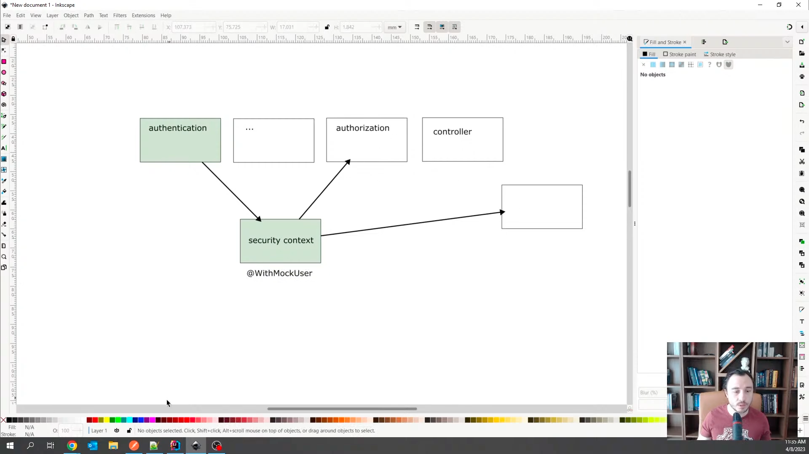
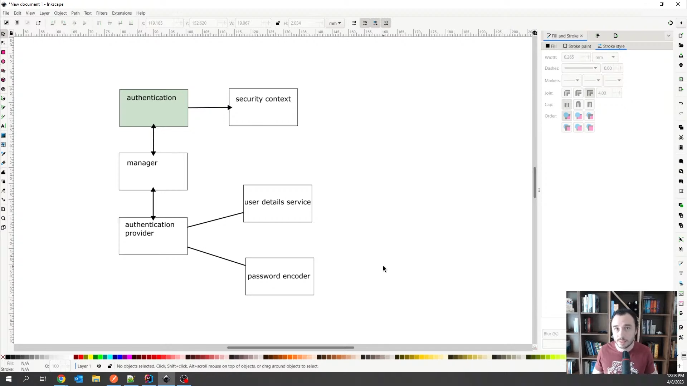

**Spring Security Mastery**

```
Spring security is application level security 

(a)Authentication
(b)Autorization
(c)Mechanissom to defeat certain kinds of attacks. Like CSRF
CROSS ORIGIN REQUESTS

There are many Levels of security( including at the network and
the infrastructure layer)
```

**Testing Spring Security Applications**

```
What we mostly test when it comes to Spring security 
is the aithrozation part.

I.e access to the endpoints

We just test the authentication once, but the autorization
is what we write tests for

We use technqiues to skip authenication, but test only for the
authorization

We mock authentication with @WithMockUser

With @WithMockUser, we create a mocked security context where
thus we can do tests for authorization.

creates a mock security context with a user inside

Spring security Basics

After Authentication, we create a Securiy contex for the 
user, that contains their authorities, that can now be used
for autorization.

We therefore have a security context before any authorization
rules.

Authentication is very critical and is the first process in the spring
security flow.

All that matters before any authorization configuration is that we have a user.

```

.

**Authentication Process**

```
(a)Authentication first of all begins with the authentication filter
(b) Authentication filter calls the authentication manager
(c) The Authentication Manager will use implementation of logic done in the authentication provider
(d)After a successful authentication, everything goes into the security context
  The details of the one who has authenticated.
(e) The security context now can be used for authorization.
  
  N/B
UserDetails service & Password Encoder

When a user is involved that has a password, we need the user detail service
because there is a very high chance the user was stored somewhere

We need also a password encoder because passwords are genrated by hash functions

Hash functions are cryptograhic alogirthims that transform an input to an output,
such that when we get an OutPut we cannot go back to the input

The only way you can veryfy whether an Output was from an Input is because of the
matches function.

This means that even if a password was stolen from a database we cannot retrieve it back.
 
```

.


**Notes**

```
MbuguaCaleb
```